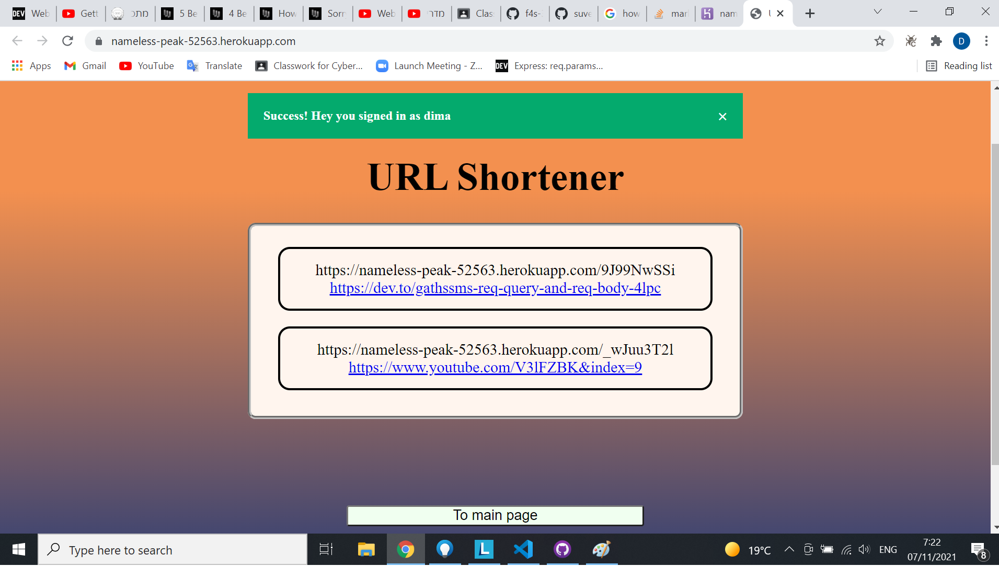
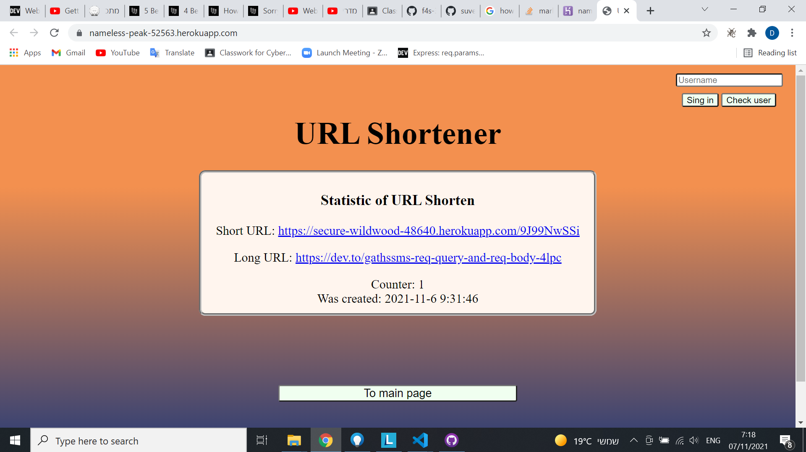
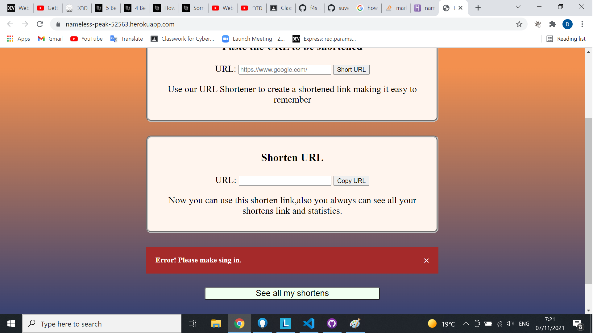

# URL shortner 📎

In this project I created my own [URL shortener](https://en.wikipedia.org/wiki/URL_shortening)!
What is it and why i doing that? So first of all it is good practice to try to work with something really usefull that other people can to use. It is interesting project that includes all of thing that fullstack developer need , like frontend, backend, work with kind of Database.

## Guidelines

- I take ideas from projects like this [example](https://www.shorturl.at/) also [this](https://url-shortener-microservice.freecodecamp.rocks/) FCC example

- I have some functionality that all my users can to try and i will tell now what is it

- First thing you have sing in area, that you must to use if you want to use my platform, you need to fill username area and you will have message if you probably singed in. ALso you have button "Check user" if you have some users for work and you regular life.

- Also you have "All my shortens" button that if you make sing in will display to you all you shortens url with regular url to which it connects

- If on list of all urls you will click in one of shorten url you will have statistic of this specific short url that have some information like:

  - `creationDate` -
  - `redirectCount` - the amount of times this url was used for redirection
  - `originalUrl`
  - `shorturl-id`

- All shorten url have uniqe ID that it will have by creating after that it will used only in server`s work and Database

- Nice looking error message that will tell you what happening with the page in the moment.

GOOD LUCK!
